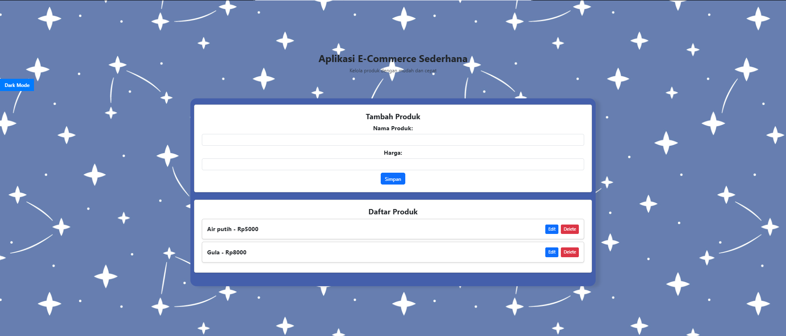
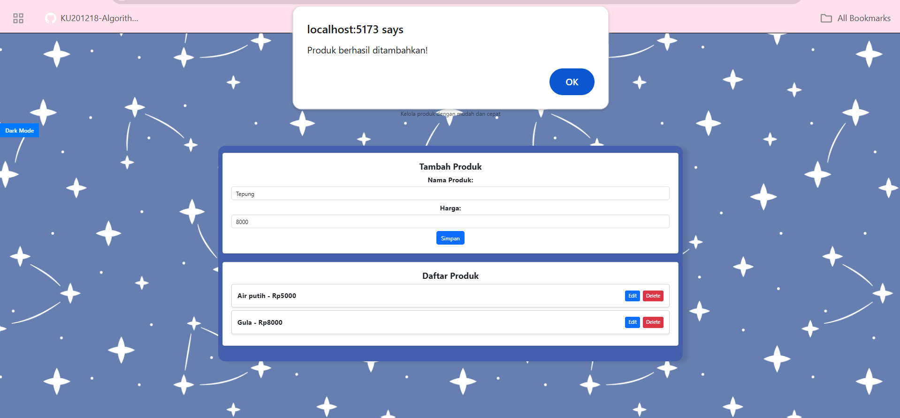
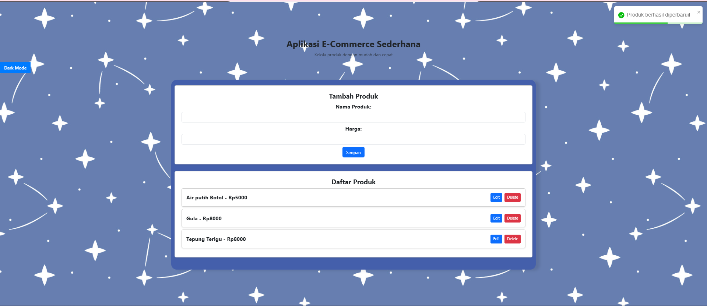
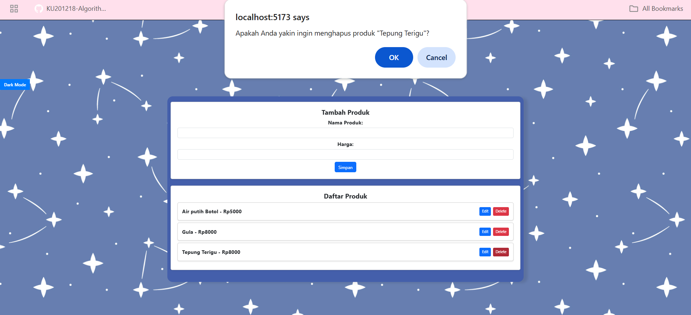
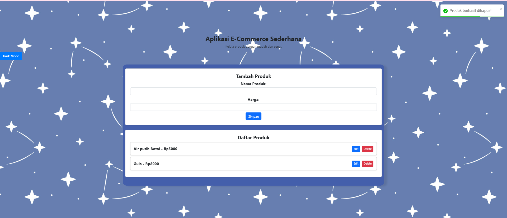
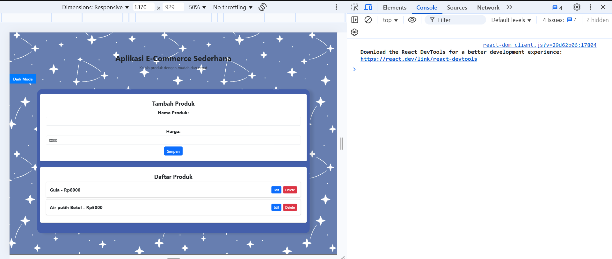
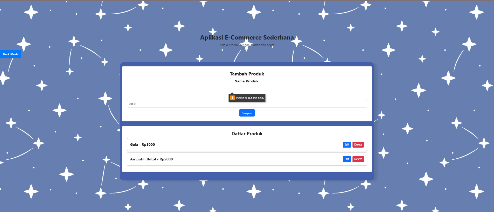

# E-Commerce Product Management System

### AVHILLA CATTON ANDALUCIA-10231021 (FRONTEND)
### IKA AGUSTIN WULANDARI-10231041 (BACKEND)

<br>

# DESKRIPSI PROYEK

Platform ini merupakan sistem manajemen produk berbasis web yang dirancang untuk mempermudah  
pengelolaan produk dalam ekosistem e-commerce. Dikembangkan menggunakan *React.js* untuk frontend  
dan *Express.js* untuk backend, aplikasi ini menghadirkan antarmuka yang interaktif serta intuitif,  
memungkinkan pengguna mengelola produk dengan lebih efisien.

## TEKNOLOGI YANG DIGUNAKAN PADA E-COMMERCE

### 1. Frontend
- *React.js*  
- *Bootstrap*  

### 2. Backend
- *Express.js*  
- *Node.js*  

### 3. Database
- *PostgresSQL*

## PREPARATION

Sebelum menjalankan aplikasi, pastikan telah menginstal:  
1. *Web browser modern* seperti Chrome, Firefox, dll.  
2. *Node.js*  
3. *NPM (Node Package Manager)*

## Installation and Usage

Install Dependensi:
```
npm install
```

Running the Backend Application:
```
node index.js
```

Running the Frontend Application:
```
npm run dev
```

# API Endpoints

Berikut adalah daftar endpoint yang digunakan dalam sistem manajemen produk e-commerce:

- *Menampilkan Semua Produk*  
GET/api/products

- *Menambahkan Produk Baru*  
POST/api/products

- *Memperbarui Data Produk*  
PUT/api/products/:id

- *Menghapus Produk*  
DELETE/api/products/:id
    
# Fitur Aplikasi

## 1. Pengelolaan Produk
- *Add*: Menyisipkan produk baru  
- *Read*: Menampilkan daftar produk yang tersedia  
- *Update*: Mengedit informasi produk  
- *Delete*: Menghapus produk dari daftar  

## 2. Validasi Input
- Pemeriksaan formulir untuk input produk  
- Tampilan pesan kesalahan yang jelas  
- Konfirmasi sebelum tindakan penting dilakukan  

## 3. Antarmuka Pengguna
- Desain yang menyesuaikan dengan berbagai perangkat  
- Efek animasi dan transisi yang halus  
- Umpan balik visual yang membantu pengguna  
- Indikator pemuatan saat aplikasi sedang memproses sesuatu

# Evaluasi Aplikasi: Berjalan Lancar Tanpa Kendala  

Aplikasi e-commerce ini telah berhasil diimplementasikan dengan berbagai fitur canggih dan user-friendly.  
Berdasarkan hasil pengujian, seluruh fungsi berjalan dengan baik tanpa ditemukan error atau bug yang signifikan.  

## Ulasan Mendetail  

### 1. Desain dan Interaksi Utama  
- Aplikasi ini menawarkan antarmuka yang *modern serta mudah digunakan, dengan fokus utama pada **pengalaman pengguna yang optimal*.  
- Di halaman utama, produk ditampilkan dalam tata letak yang *terorganisir dan responsif, memastikan **navigasi yang intuitif* bagi pengguna.

# Fitur-Fitur Utama

## 1. Manajemen Produk
- *Daftar produk* dengan tampilan interaktif 
- *Badge* penghitung jumlah produk  
- *Status ketersediaan produk*  


## 2. Sistem CRUD yang Lengkap

### ➕ Penambahan Produk
- *Form input* yang intuitif  
- *Validasi data real-time*  


### ✏ Pembaruan Produk
- *Modal edit* dengan data *terpopulasi*  
- *Preview perubahan langsung*  



### 🗑 Penghapusan Produk
- *Modal konfirmasi* yang aman  
- *Feedback visual* yang jelas  
- *Update tampilan* secara real-time  



## 3. User Experience
- *Desain responsif* di berbagai perangkat  
- *Feedback visual* yang informatif  
- *Navigasi mudah* dan intuitif  
- *Pesan error* yang jelas dan membantu


## Validasi dan Error Handling  

Aplikasi dilengkapi dengan sistem validasi yang *komprehensif*, termasuk:  

- *Pencegahan input kosong* dengan pesan error yang jelas  
- *Highlight field* yang memerlukan perhatian  
- *Panduan pengguna* yang informatif


# KESIMPULAN  

Setelah melewati berbagai tahap *pengujian* dan *penyempurnaan*, aplikasi ini terbukti berhasil dengan:  

1. *Beroperasi secara stabil* tanpa kendala teknis  
2. *Memiliki kinerja optimal* dan responsif  
3. *Menyediakan antarmuka pengguna (UI/UX) yang modern* serta mudah digunakan  

Seluruh fitur yang dikembangkan telah berfungsi sesuai dengan spesifikasi yang dirancang sebelumnya.  
Keberhasilan ini berperan penting dalam menciptakan *pengalaman pengguna yang lancar, efisien, dan profesional* dalam pengelolaan produk di platform e-commerce.  

Dengan sistem yang berjalan optimal, pengguna dapat dengan mudah melakukan berbagai aktivitas *manajemen produk—seperti **menambah, mengedit, dan menghapus produk—secara cepat dan tanpa hambatan, sehingga meningkatkan **efisiensi operasional secara keseluruhan*.

# Troubleshooting 

## Masalah Umum dan Solusinya  

1. *Server tidak dapat dijalankan:*  
   - Pastikan *port 3001* tidak sedang digunakan oleh aplikasi lain.  
   - Periksa apakah *Node.js dan NPM* telah terinstal dengan benar.  

2. *Frontend tidak dapat diakses:*  
   - Pastikan semua dependensi telah terinstal dengan menjalankan:  
     sh
     npm install
     
   - Cek *konsol browser* untuk melihat adanya error yang terjadi.  

3. *API tidak memberikan respons:*  
   - Pastikan *server backend sedang berjalan*.  
   - Periksa kembali *URL serta port* yang digunakan agar sesuai dengan konfigurasi.